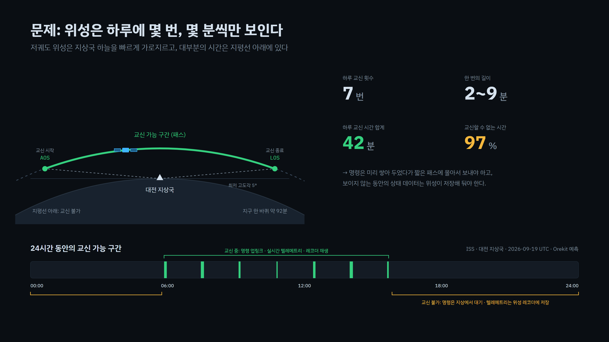
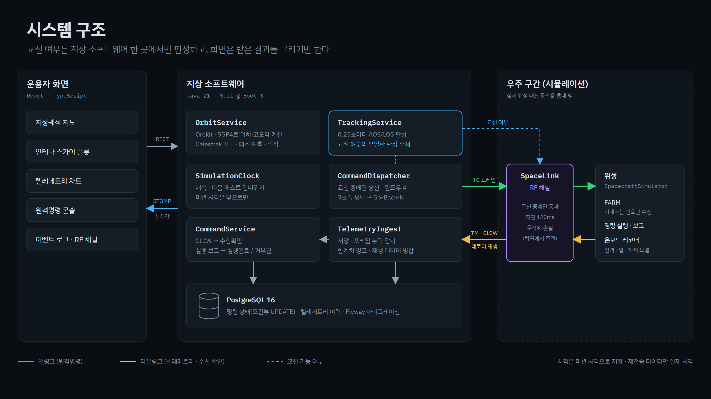
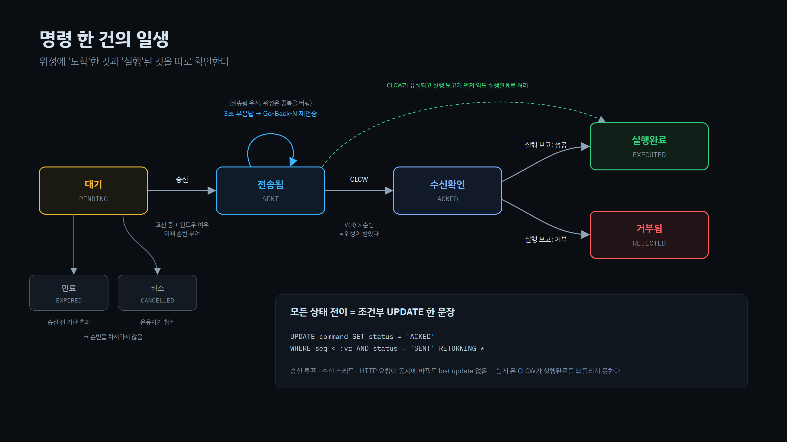
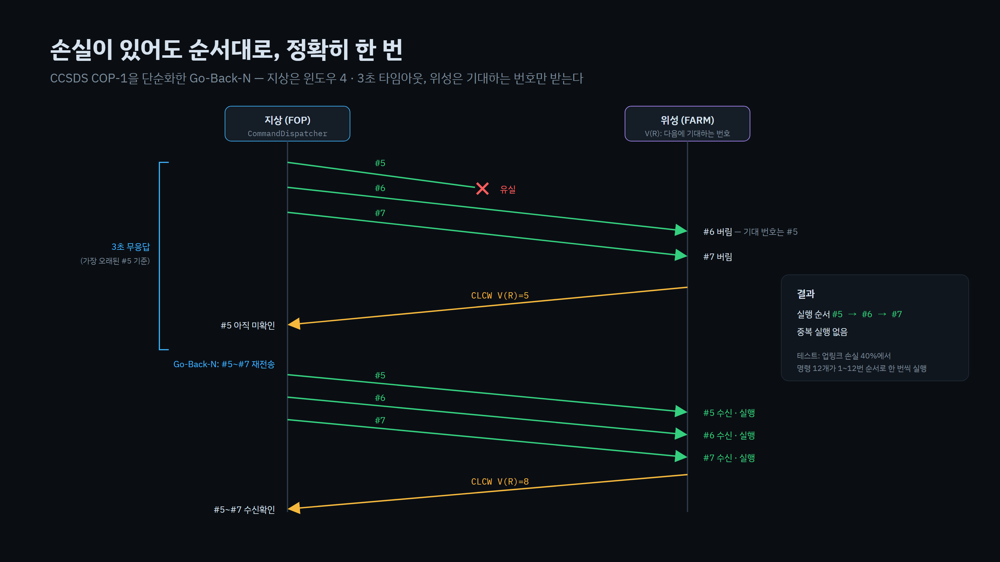

# 위성 지상국 관제 콘솔 (TT&C Console)

[](https://github.com/2Dokk/ttc-console/actions/workflows/ci.yml)

위성은 지상국 상공을 지나는 **몇 분 동안만** 교신할 수 있습니다.
이 프로젝트는 그 제약 속에서도 **명령과 데이터를 잃지 않는** 지상국 소프트웨어입니다.


## 무엇을 하나요

- **교신 가능 구간 계산** — 실제 공개 궤도 데이터(TLE)로 위성이 대전 지상국에서 보이는 시간(AOS~LOS)을 계산합니다.
- **명령 대기와 전송** — 교신이 안 될 때 보낸 명령은 쌓아 두었다가, 교신이 되면 순서대로 보냅니다.
- **유실돼도 정확히 한 번** — 전송 중 명령이 사라져도 다시 보내고, 위성에서는 순서대로 한 번씩만 실행됩니다.
- **끊긴 동안의 데이터 복구** — 교신이 안 될 때 위성이 저장해 둔 상태 데이터를 다음 교신 때 받아 채웁니다.

## 왜 어려운가



## 어떻게 만들었나



- 교신 가능 여부는 **서버 한 곳에서만** 판정합니다. 화면은 결과를 그리기만 합니다.
- 궤도 계산은 검증된 라이브러리 **Orekit**을 사용했습니다.
- 우주 구간(통신 채널과 위성)은 시뮬레이션입니다. 손실률을 화면에서 바꿔 볼 수 있습니다.

### 명령은 '도착'과 '실행'을 따로 확인합니다



### 유실되면 다시 보내고, 위성은 순서대로만 받습니다



위성 명령 전송 표준(CCSDS COP-1)의 구조를 단순화해 적용했습니다.
업링크 손실률 40%에서도 명령 12개가 1번부터 12번까지 한 번씩 실행되는 것을 자동 테스트로 확인합니다.

## 실행하기

필요한 것: JDK 21, Node 20 이상, Docker (아래 세 줄은 각각 다른 터미널에서, 저장소 폴더 기준으로 실행)

```bash
docker compose up -d                       # 데이터베이스
cd backend && ./gradlew bootRun            # 서버 (8080)
cd frontend && npm install && npm run dev  # 화면 (5173)
```

http://localhost:5173 에 접속한 뒤 **다음 패스로 건너뛰기**와 **×10** 배속을 누르면 바로 교신 장면을 볼 수 있습니다.

## 테스트

```bash
cd backend && ./gradlew test
```

테스트 20개가 궤도 계산, 명령 순서, 재전송, 동시 수정 방지를 검증합니다. push할 때마다 GitHub Actions에서도 실행됩니다.

## 기술 스택

Java 21 · Spring Boot 3 · Orekit 13 · PostgreSQL 16 · WebSocket(STOMP) · React · TypeScript · Testcontainers · GitHub Actions

## 한계

- 위성과 통신 채널은 시뮬레이션이며, 배터리·온도 값은 실제 위성 수치가 아닙니다.
- CCSDS 표준은 핵심 구조만 따랐고, 실제 바이너리 패킷 형식은 구현하지 않았습니다.
- 위성 1대, 지상국 1곳만 다룹니다.

<details>
<summary>설계 세부 사항</summary>

- **시뮬레이션 시계**: 배속과 건너뛰기를 지원하고, 미션 시각은 앞으로만 갑니다. 재전송 타이머만 실제 시각을 씁니다(전파 왕복 시간은 배속과 무관하므로).
- **순번 부여 시점**: 명령을 처음 보낼 때 번호를 붙입니다. 등록할 때 붙이면 만료·취소된 명령이 번호 구멍을 만들어, 위성이 이후 명령을 계속 거부하게 됩니다.
- **동시 수정 방지**: 모든 명령 상태 변경을 `UPDATE ... WHERE status = ...` 한 문장으로 처리해, 늦게 온 응답이 이미 끝난 명령을 되돌리지 못합니다.
- **윈도우와 타임아웃**: 확인 없이 최대 4개까지 보내고, 3초 안에 응답이 없으면 미확인 명령을 순서대로 모두 다시 보냅니다.
- **한계치 경고**: 배터리 25% 미만, 온도 −5~35°C 이탈 같은 고정 기준만 사용합니다.
- **재시작**: 저장된 기록보다 과거로 시각이 돌아가지 않게 하고, 지상과 위성의 명령 번호를 다시 맞춥니다.

</details>

<details>
<summary>API</summary>

| 요청 | 설명 |
|---|---|
| `GET /api/state` | 미션 시각, 위성 위치, 교신 여부, 현재·다음 패스 |
| `GET /api/passes` | 다가오는 패스 목록 |
| `POST /api/commands` | 명령 등록 `{ "type": "SET_MODE", "args": { "mode": "MISSION" } }` |
| `GET /api/commands` | 명령 목록과 상태 |
| `POST /api/commands/{id}/cancel` | 대기 중인 명령 취소 |
| `GET /api/telemetry` | 저장된 텔레메트리 |
| `POST /api/clock/speed`, `/api/clock/skip-to-next-pass` | 배속, 다음 패스로 건너뛰기 |
| `GET` / `PUT /api/link` | 통신 채널 손실률과 통계 |

실시간 데이터는 WebSocket `/ws`의 `/topic/state`, `/topic/telemetry`, `/topic/commands`, `/topic/events`로 전달됩니다.

</details>
