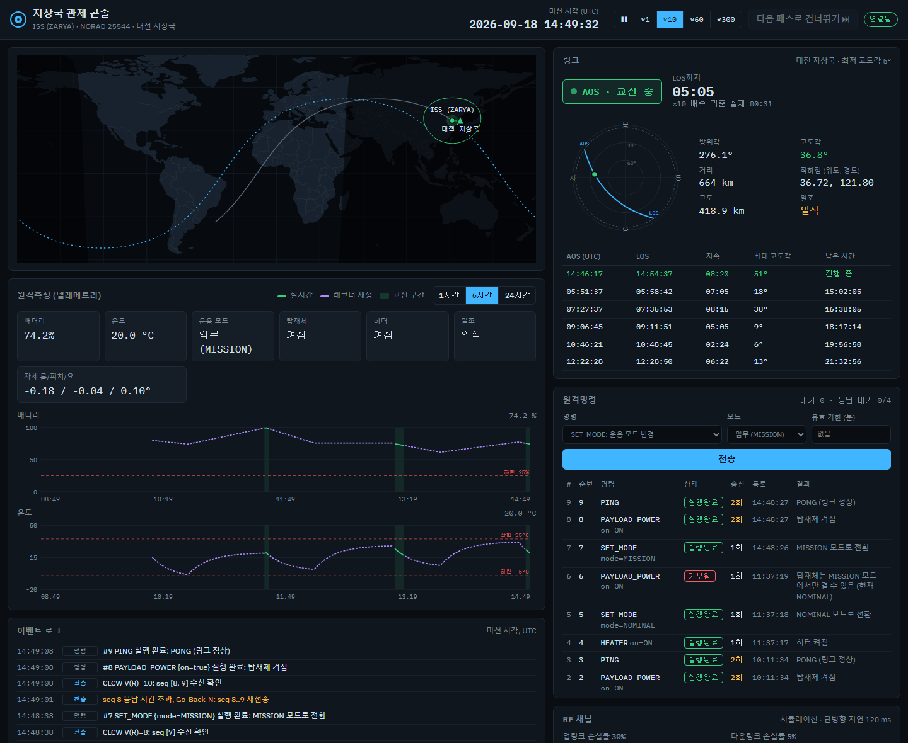
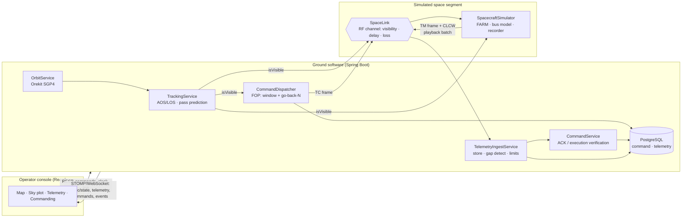

# 위성 지상국 관제 콘솔 (TT&C Console)



위성은 지상국과 항상 통신할 수 있는 게 아니라, **지상국 상공을 지나가는 몇 분(가시권, pass) 동안만** 통신할 수 있습니다.
이 프로젝트는 그 제약을 그대로 옮긴 소형 위성 관제 시스템입니다.

- 실제 공개 궤도 데이터(Celestrak TLE)와 SGP4로 위성 위치와 **AOS/LOS(가시권 진입/이탈)** 를 계산
- 가시권 안에서만 텔레메트리가 실시간으로 내려오고, 밖에서는 위성이 **온보드 레코더에 저장했다가 다음 패스에 재생(playback)**
- 가시권 밖에서 보낸 명령은 지상에 **대기(PENDING)** 했다가, 가시권에 들어오면 **CCSDS COP-1을 단순화한 슬라이딩 윈도우 + Go-Back-N** 으로 순서대로 한 번씩만 전달
- 명령은 **전달 확인(ACK)** 과 **실행 확인(EXECUTED/REJECTED)** 을 따로 검증

> 방산·우주 SW(위성 지상체) 직무를 준비하면서, 위성-지상국 통신이 간헐적이라는 특성을 이해하고 직접 구현해 본 프로젝트입니다.
> 위성 버스(전력·열·자세)는 **학습용 장난감 모델**이고, 수치는 실제 위성 값이 아닙니다. 궤도와 가시권 계산만 실제 데이터 기반입니다.

---

## 데모 시나리오 (3분)

1. `다음 패스로 건너뛰기` 를 누르면 미션 시각이 다음 AOS 60초 전으로 이동합니다. `×10` 으로 배속합니다.
2. 교신 불가(LOS) 상태에서 `SET_MODE: 운용 모드 변경 → 임무` → `PAYLOAD_POWER: 탑재체 전원 → 켜기` 를 보냅니다. 둘 다 **대기(PENDING)** 로 쌓입니다.
3. AOS가 되면 이벤트 로그에 `AOS: 대기 2건 ... 업링크 시작` 이 찍히고, 명령이 순번(seq) 순서대로 **전송됨 → 수신확인 → 실행완료** 로 바뀝니다.
4. `RF 채널` 에서 업링크 손실률을 40%로 올리고 명령을 몇 개 더 보내면 `응답 시간 초과, Go-Back-N ... 재전송` 이 일어납니다. 그래도 위성에서는 **여전히 순서대로 정확히 한 번씩** 실행됩니다.
5. AOS 직후 텔레메트리 차트에 보라색 **레코더 재생** 곡선이 채워집니다. LOS 동안 비어 있던 구간을 위성이 녹화해 둔 데이터입니다.
6. 배터리가 40% 미만일 때 임무 모드로 바꾸는 명령을 보내면 **수신확인(전달 성공)** 까지는 가지만, 위성이 거부해서 **거부됨** 으로 끝납니다.

---

## 아키텍처



| 계층 | 기술 | 역할 |
|---|---|---|
| 궤도 | **Orekit 13** (Java) | TLE → SGP4 전파, 지상국 기준 방위/고도각, `ElevationDetector` 로 AOS/LOS 근 찾기, 일식 판정 |
| 백엔드 | Spring Boot 3, STOMP WebSocket, JdbcTemplate, Flyway | 추적 루프, 명령 큐/전송, 텔레메트리 수신·저장 |
| DB | PostgreSQL 16 | 명령 상태, 텔레메트리 이력 |
| 프론트 | React + TypeScript (Vite) | 지상궤적 지도, 폴라 스카이 플롯, 텔레메트리 차트, 명령 콘솔 |

---

## 설계 결정

### 1. 가시권 판정은 백엔드 한 곳에서만
명령을 PENDING으로 둘지, 텔레메트리를 흘릴지는 모두 "지금 보이는가"에 달려 있습니다. 브라우저에서 계산하면 탭을 닫는 순간 관제가 멈추고,
클라이언트마다 판정이 달라질 수 있습니다. 그래서 `OrbitService` / `TrackingService` 가 유일한 판정 주체이고, 프론트는 받은 값을 그리기만 합니다.

처음 스펙에서는 프론트에서 `satellite.js` 를 쓰려 했지만, 판정 주체를 백엔드로 옮기면서 Java 궤도역학 라이브러리인 **Orekit** 으로 바꿨습니다.
AOS/LOS는 고도각을 샘플링해서 임계값과 비교하지 않고, Orekit의 이벤트 검출기로 `elevation − mask = 0` 의 근을 1ms 정밀도로 찾습니다
(테스트에서 AOS/LOS 시각의 고도각이 5° ± 0.05° 인지 확인).

### 2. 시뮬레이션 시계
ISS가 대전 상공을 지나는 건 하루 몇 번, 한 번에 3~8분입니다. 실제 시간 그대로면 시연이 불가능하고 테스트도 쓸 수 없습니다.
`SimulationClock` 은 배속(×0~×1000)과 "다음 패스로 건너뛰기"를 지원하고, **앞으로만** 움직입니다(명령·텔레메트리 이력이 미션 시간 기준이므로).
벽시계(`java.time.Clock`)를 주입받기 때문에 테스트에서는 시간을 손으로 돌립니다.

미션 시간과 벽시계를 일부러 구분했습니다. 궤도·명령 만료는 미션 시간, **재전송 타이머는 벽시계** 입니다.
RF 왕복 시간은 시뮬레이션 배속과 무관하게 실제 시간이기 때문입니다.

### 3. 명령 전달: 슬라이딩 윈도우 + Go-Back-N (단순화한 CCSDS COP-1)
대학 컴퓨터네트워크 수업에서 다룬 재전송/큐잉 문제가 우주 통신에서는 CCSDS COP-1(FOP-1 / FARM-1)이라는 표준으로 정리되어 있습니다.
이 프로젝트는 그 구조를 단순화해 구현했습니다.

- **지상 FOP** (`CommandDispatcher`): 가시권일 때만 송신합니다. 미확인 프레임은 최대 `window-size`(기본 4)개까지 허용하고,
  가장 오래된 프레임의 ACK가 `ack-timeout` 안에 오지 않으면 **미확인 프레임 전부를 순서대로 재전송** 합니다.
- **위성 FARM** (`Farm`): 다음에 기대하는 번호 V(R)의 프레임만 받습니다. 이미 받은 번호는 버리고(중복), 건너뛴 번호도 버립니다(누락).
  그래서 지상이 몇 번을 재전송하든 **정확히 한 번, 순서대로** 실행됩니다.
- **ACK = CLCW**: 위성이 매 다운링크 프레임에 V(R)을 실어 보냅니다. 프레임 하나를 잃어도 다음 프레임이 같은 정보를 다시 가져옵니다.
- **시퀀스 번호는 첫 송신 시점에 부여** 합니다. 생성 시점에 부여하면, 만료·취소된 명령이 번호 구멍을 만들어 FARM이 영원히 그 번호를 기다리게 됩니다.

`CommandUplinkIT.lossyChannelStillDeliversEveryCommandExactlyOnceAndInOrder` 가 업링크 40%, 다운링크 30% 손실에서도
12개 명령이 1..12 순서로 한 번씩 실행되는지 검증합니다.

### 4. 전달 확인과 실행 확인을 분리
```
PENDING ──tx──▶ SENT ──CLCW──▶ ACKED ──실행 보고──▶ EXECUTED | REJECTED
   │              └─ timeout: go-back-N 재전송 (SENT 유지)
   └─▶ EXPIRED(송신 전 기한 초과) | CANCELLED(운용자 취소)
```
프레임이 위성에 도착하는 것과 위성이 그 명령을 수행하는 것은 다른 문제입니다(예: 배터리 부족으로 MISSION 모드 거부).
실행 결과는 텔레메트리에 최근 8건이 반복해서 실려 오므로, 일부 프레임이 유실돼도 결국 반영됩니다.

### 5. 상태 전이는 조건부 UPDATE 하나 (compare-and-set)
디스패처 스레드, RF 수신 스레드, HTTP 요청이 같은 명령 행을 동시에 바꿀 수 있습니다. 모든 전이를
`UPDATE ... WHERE status IN (...) RETURNING *` 한 문장으로 처리해 lost update를 막았습니다.
예를 들어 늦게 도착한 CLCW가 이미 EXECUTED인 명령을 ACKED로 되돌릴 수 없고, 이미 송신 중인 명령은 취소되지 않습니다.
(`lateAcknowledgementNeverRollsBackAnExecutedCommand` 테스트)

### 6. 텔레메트리: 실시간 + 저장 후 재생
- 가시권: 1초마다 실시간 프레임. 프레임 카운터가 건너뛰면 지상에서 유실로 집계합니다.
- 비가시권: 위성이 60초(미션 시간) 간격으로 온보드 레코더에 기록합니다(용량 초과 시 가장 오래된 것부터 덮어씀).
- 다음 AOS: 레코더를 청크 단위로 덤프하고, 지상은 `recordedAt`(위성 시각)과 `receivedAt`(수신 시각)을 따로 저장합니다.
  차트에서 LOS 동안 비었던 구간이 채워집니다.

### 7. 이상 감시는 고정 한계치 비교
배터리 25% 미만, 온도 −5~35°C 이탈 같은 **고정 한계치(limit check)** 만 봅니다. 학습된 모델이 아니므로 "AI 이상탐지"라고 부르지 않습니다.
위성 쪽에는 배터리 15% 미만이면 스스로 SAFE 모드로 들어가는 단순한 FDIR이 있습니다.

---

## 실행

필요: JDK 21, Node 20+, Docker

```bash
docker compose up -d
```

```bash
cd backend && ./gradlew bootRun
```
처음 실행하면 Orekit 물리 데이터(약 40MB, 윤초·지구자전·천체력)를 `backend/orekit-data` 에 한 번 내려받습니다.
시작할 때 Celestrak에서 최신 TLE를 받아 오고, 오프라인이면 DB에 있는 TLE를 씁니다.

```bash
cd frontend && npm install && npm run dev
```
http://localhost:5173 에 접속합니다(Vite가 `/api`, `/ws` 를 8080으로 프록시).

추적 위성은 `backend/src/main/resources/application.yml` 의 `gsc.satellite-id` 로 바꿀 수 있습니다(1 = ISS, 2 = KOMPSAT-3A).

## 테스트

```bash
cd backend && ./gradlew test
```
Docker가 켜져 있어야 합니다(Testcontainers로 실제 PostgreSQL 사용).

| 테스트 | 검증 내용 |
|---|---|
| `OrbitServiceTest` | ISS 고도/경사각 범위, AOS/LOS 시각의 고도각 = 마스크 ± 0.05°, 패스 순서·비중첩, 패스 중간에 재예측해도 AOS 유지 |
| `SimulationClockTest` | 배속, 배속 변경 시 시간 연속성, 과거로 점프 금지, 일시정지 |
| `FarmTest` | 순서 수락, 중복 폐기 + 재ACK, 누락 시 재전송 플래그 |
| `CommandUplinkIT` | LOS 대기 → AOS 일괄 송신 순서, 윈도우 제한, 타임아웃 시 Go-Back-N, 늦은 ACK의 롤백 방지, 거부 처리, 만료·취소가 번호를 소모하지 않음, 손실 채널에서 exactly-once·in-order |

## API

| | |
|---|---|
| `GET /api/state` | 미션 시간, 위성 위치, 방위/고도각, 가시 여부, 현재/다음 패스 |
| `GET /api/passes?count=6` | 다가오는 패스 목록 |
| `GET /api/passes/active/skytrack` | 현재(또는 다음) 패스의 az/el 궤적 |
| `GET /api/orbit/track` | 지상궤적 |
| `POST /api/commands` | `{ "type": "SET_MODE", "args": { "mode": "MISSION" }, "expiresInMinutes": 30 }` |
| `GET /api/commands`, `POST /api/commands/{id}/cancel` | 명령 로그, 대기 중 명령 취소 |
| `GET /api/telemetry?minutes=360` | 저장된 텔레메트리(실시간 + 재생) |
| `POST /api/clock/speed`, `POST /api/clock/skip-to-next-pass` | 시뮬레이션 시계 |
| `GET/PUT /api/link` | 채널 손실률 설정, 송수신 통계 |

WebSocket(STOMP) `/ws`: `/topic/state`(4Hz), `/topic/telemetry`, `/topic/telemetry/playback`, `/topic/commands`, `/topic/events`

---

## 한계와 개선 방향

일부러 단순화했거나 아직 못 한 부분입니다.

- **COP-1은 핵심 구조만 구현했습니다.** Lockout, Wait 상태, 재전송 한도 초과 시 FOP 중지와 운용자 개입, BD(바이패스) 프레임, Set V(R) 지시는 없습니다.
  재시작할 때는 지상과 위성 시뮬레이터가 함께 재시작한다고 가정하고 V(S)/V(R)를 맞춥니다.
- **프레임은 CCSDS 바이너리 포맷이 아니라 Java 객체입니다.** 다음 단계로 TM/TC를 CCSDS Space Packet으로 인코딩하는 것을 계획하고 있습니다.
- **레코더 재생은 손실이 없다고 가정합니다.** 실제로는 CFDP 같은 파일 단위 재전송이 필요합니다.
- **가시권은 고정 고도각 마스크(5°) 하나로 판정합니다.** 지형 마스크, 안테나 구동 속도 제한, 링크 버짓(거리에 따른 신호 세기)은 고려하지 않습니다.
- **단일 위성, 단일 지상국입니다.** 스키마는 `satellite_id` 를 두어 확장할 수 있게 했지만 스케줄링(여러 위성의 패스 충돌 조정)은 없습니다.
- 위성 버스 모델(전력·열·자세)은 시각화를 위한 1차 근사이고 실제 위성 수치가 아닙니다.
- 디스패처는 단일 인스턴스를 전제로 합니다. 다중 인스턴스라면 `SELECT ... FOR UPDATE SKIP LOCKED` 나 리더 선출이 필요합니다.
